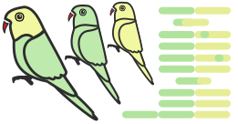
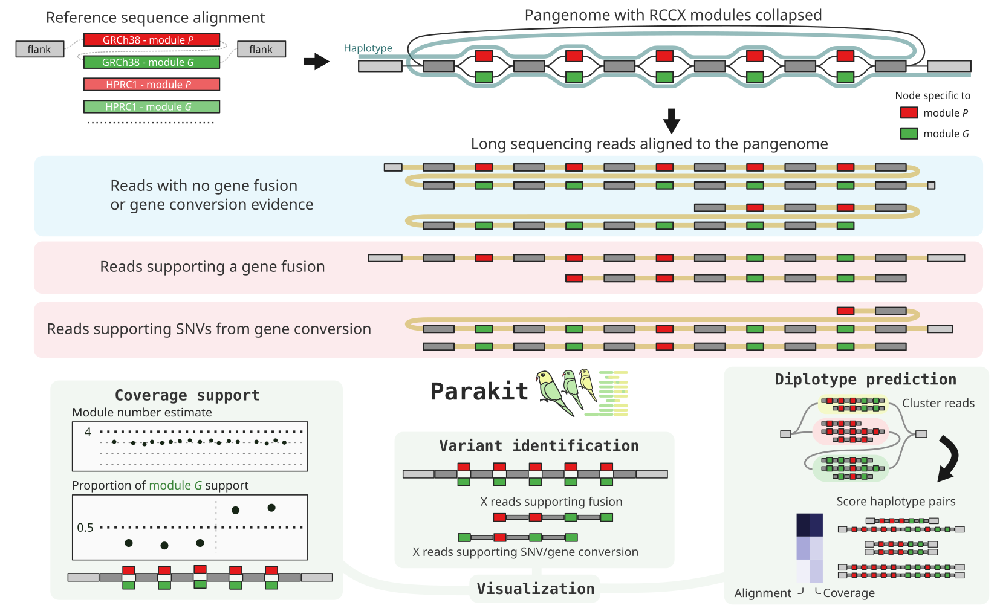
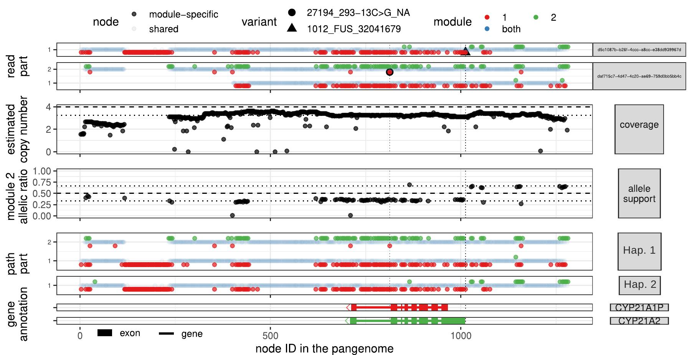

# Parakit



Parakit is a tool to analyze the RCCX module, which contain the CYP21A2 gene, using long sequencing reads. 
A first version was used to analyze ONT R10 data and made use of 65?? high-quality assemblies from the HPRC consortium. 
This version is described and benchmarked in CITEMEDRXIV, and more information can be found in the [`paper`](paper) directory.
It is still in active development, especially to extend this approach to other loci and keep improving the resolution (new features, larger pangenome, other sequencing technologies).

Starting from an indexed BAM file, reads in the RCCX region are extracted and realigned to a local pangenome were both modules are collapsed.
Parakit then looks for pathogenic variants supported by multiple types of signal: read coverage, allele support, read support, diplotype reconstruction. 

- [Installation](#installation)
- [GRCh38+HPRC RCCX pangenome](#GRCh38-HPRC-RCCX-pangenome)
- [Commands](#commands)
- [Output](#output)
- [Citation](#citation)



## Installation

Clone the repo and install locally with:

```sh
git clone https://github.com/jmonlong/parakit.git
cd parakit
python3 -m pip install -e .
```

It might be a good idea to use a virtual environment:

```sh
## to create the environment
python3 -m venv parakit_venv
## to activate it
source parakit_venv/bin/activate
## intall
## run from the directory where the repo was cloned
pip3 install -e .
## deactivate env when you're done
deactivate
```

Then, you can use Parakit anytime you activate this environment.

### Dependencies

Parakit will use the following external tools:

- [vg](https://github.com/vgteam/vg)
- [samtools](https://samtools.github.io/)
- [docker](https://docs.docker.com/engine/install/)
- R with the following packages:
    - dplyr
    - ggplot2
    - tidyr
    - RColorBrewer
    - GenomicRanges
    - cowplot
- gunzip

*Soon: a Docker image with all the dependencies.*

## GRCh38+HPRC RCCX pangenome

Ready-to-use files for the RCCX pangenome, available in the [`data` folder](data):

- `rccx.grch38_hprc.mc.config.json` the configuration file for this pangenome (contains coordinates, flank size, etc used to build the pangenome)
- `rccx.grch38_hprc.mc.pg.gfa` the pangenome in GFA format
- `rccx.grch38_hprc.mc.node_info.tsv` metadata about the nodes in the pangenome, e.g. which one is specific to module 1/2.
- Annotation files:
    - `CYP21A2.pathogenic.variant_summary.2024_09_03.tsv` reformatted subset of ClinVar including CYP21A2 pathogenic variants
    - `CYP21A2.gencodev43.nearby_genes.tsv` reformatted subset of GENCODE containing gene annotation in the region.

See [data/rccx.summary.md](data/rccx.summary.md) for some descriptive metrics on this pangenome.

The files mentioned above are the output of the pangenome construction.
They can be used to analyze a new long-read sequencing samples using the [commands](#commands) below.
For info, the steps to construct the pangenome are described in the [`data` folder](data).

## Commands

For example, to analyze one sample with an indexed BAM file (aligned to GRCh38).

To extract relevant reads and map them to the pangenome:

```bash
parakit map -j rccx.grch38_hprc.mc.config.json -b input.bam -o reads.gaf.gz
```

This creates the `reads.gaf.gz` GAF file.

Then, to look for variant-supporting reads:

```bash
parakit call -j rccx.grch38_hprc.mc.config.json -r reads.gaf.gz -o calls.tsv
```

The reads/calls are saved in `calls.tsv`.

To list and evaluate candidate diplotype:

```bash
parakit diplotype -j rccx.grch38_hprc.mc.config.json -r reads.gaf.gz -o diplotype
```

This command creates two files: 

- `diplotype.paths-stats.tsv` with the diplotypes ranked by score (based on read alignment and coverage).
- `diplotype.paths-info.tsv` with the path taken by each haplotype through the pangenome.

Finally, the visualization command makes a figure. 
The *all* mode, will make a multi-panel figure summarizing all analysis.

```bash
parakit viz -v all -j rccx.grch38_hprc.mc.config.json -r reads.gaf.gz -c calls.tsv -d diplotype.paths-stats.tsv -p diplotype.paths-info.tsv -o parakit.out.pdf
```

Other modes include: 

- *all_small* (a slightly more compact version of the *all* mode)
- *calls* just the results of variant calling and the reads supporting them
- *allele_support* just the coverage and allele ratio results
- *diplotype* just the diplotype prediction results

## Output

Example of a summary figure generated by Parakit:



This sample shows strong evidence of a fusion and pathogenic SNV in a compound heterozygous configuration.

Points are positioned based on their position in the pangenome (x-axis). 
Because it's based on node position, some large regions are compressed.
This means that the x-axis is not exactly to scale with the genome sequence.

- Reads supporting pathogenic variants (black circle and triangle).
    - Here showing only one supporting read per variant (the longest read).
    - The variant position are highlighted by the black circle (SNV) and triangle (fusion).
    - The variants location are also marked by the vertical dotted lines in all panels, to help compare the different analyses.
- Copy number estimate from read coverage.
    - The dots shows the read coverage on each node across the region
    - The dashed line highlights the global copy number estimate based on this read coverage.
    - The dotted line is another global copy number estimate, often more robust to mapping bias. It is based on the reads around the boundaries and of the module, basically comparing looking at reads supporting extra copies (cycling back) and reads entering/leaving the module.
- Allele balance as the ratio of module 2 support. 
    - Expected around 0.5 if carrying two bimodular alleles (one module 1, one module 2). 
    - Deviation suggests fusions (or large gene conversion regions).
    - Faint blue lines highlight 1/3 and 2/3 marks, the expected levels in the presence of one fusion allele (and one bimodular allele).
- Diplotype candidate. Two haplotypes that match the reads best in term of alignment and coverage.
- Gene annotation

For the reads and diplotype panels, points are colored to highlight informative nodes (specific to module 1 in red or 2 in green).
Informative nodes/points are slightly shifted to help distinguish them.
The reads/haplotypes are split in parts when they loop back in the pangenome.

## Next

- [ ] Prepare (small) Docker image with dependencies.
- [ ] Annotate assembled contigs.
- [ ] Test on Pacbio reads.
- [ ] Finish automating pangenome construction and test on different region. 
