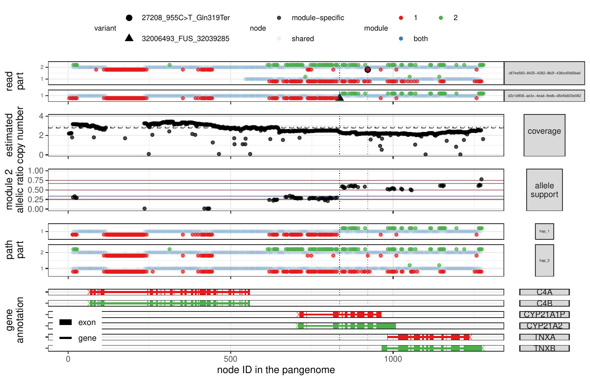

# Parakit


Parakit is a tool to analyze the RCCX module, which contain the CYP21A2 gene, using long sequencing reads. 
It is still in active development and is currently focusing on ONT R10 data. 

Starting from an indexed BAM file, reads in the RCCX region are extracted and realigned to a local pangenome were both modules are collapsed.
Parakit then looks for pathogenic variants supported by multiple types of signal: read coverage, allele support, read support, diplotype reconstruction. 

## Installation

For now, clone the repo and install locally with:

```sh
python3 -m pip install -e .
```

It might be a good idea to use a virtual environment:

```sh
## to create the environment
python3 -m venv parakit_venv
## to activate it
source parakit_venv/bin/activate
## intall
pip3 install -e .
## deactivate env
deactivate
```

Then, you can use Parakit anytime you activate this environment.

### Dependencies

- [vg](https://github.com/vgteam/vg)
- [samtools](https://samtools.github.io/)
- [docker](https://docs.docker.com/engine/install/)
- R with the following packages:
    - dplyr
    - ggplot2
    - tidyr
    - RColorBrewer
    - GenomicRanges
    - cowplot
- gunzip

*Soon: a Docker image with all dependencies.*

## GRCh38+HPRC RCCX pangenome

Ready-to-use files for the RCCX pangenome, available in the [`data` folder](data):

- `rccx.grch38_hprc.mc.config.json` the configuration file for this pangenome (contains coordinates, flank size, etc used to build the pangenome)
- `rccx.grch38_hprc.mc.pg.gfa` the pangenome in GFA format
- `rccx.grch38_hprc.mc.node_info.tsv` metadata about the nodes in the pangenome, e.g. which one is specific to module 1/2.
- Annotation files:
    - `CYP21A2.pathogenic.variant_summary.20231127.txt` reformatted subset of ClinVar including CYP21A2 pathogenic variants
    - `CYP21A2.gencodev43.nearby_genes.tsv` reformatted subset of GENCODE containing gene annotation in the region.

See [data/rccx.summary.md](data/rccx.summary.md) for some descriptive metrics on this pangenome.

## Commands

For example, to analyze one sample with an indexed BAM file (aligned to GRCh38).

To extract relevant reads and map them to the pangenome:

```bash
parakit map -j rccx.grch38_hprc.mc.config.json -b input.bam -o reads.gaf.gz
```

This creates the `reads.gaf.gz` GAF file.

Then, to look for variant-supporting reads:

```bash
parakit call -j rccx.grch38_hprc.mc.config.json -r reads.gaf.gz -o calls.tsv
```

The reads/calls are saved in `calls.tsv`.

To list and evaluate candidate diplotype:

```bash
parakit paths -j rccx.grch38_hprc.mc.config.json -r reads.gaf.gz -o diplotype
```

This command creates two files: 

- `diplotype.paths-stats.tsv` with the diplotypes ranked by score (based on read alignment and coverage).
- `diplotype.paths-info.tsv` with the path taken by each haplotype through the pangenome.

Finally, the visualization command makes a figure. 
The *all* mode, will make a multi-panel figure summarizing all analysis.

```bash
parakit viz -v all -j rccx.grch38_hprc.mc.config.json -r reads.gaf.gz -c calls.tsv -d diplotype.paths-stats.tsv -p diplotype.paths-info.tsv -o parakit.out.pdf
```

Other modes include: *calls*, *allele_support*, *paths*.

## Output



Points are positioned based on their position in the pangenome (x-axis). 
Because it's based on node position, some large regions are compressed.
This means that the x-axis is not exactly to scale with the genome sequence.

- Reads supporting pathogenic variants (black circle and triangle).
- Copy number estimate from read coverage.
- Allele balance as the ratio of module 2 support. Expected around 0.5. Deviation suggest fusions (or large gene conversion regions).
- Diplotype candidate. Two haplotypes that match the reads best in term of alignment and coverage.
- Gene annotation

For the reads and diplotype panels, points are colored to highlight informative nodes (specific to module 1 in red or 2 in green).
Informative nodes/points are slightly shifted to help distinguish them.
The reads/haplotypes are split in parts when they loop back in the pangenome.

## TODO

- [ ] Prepare (small) Docker image with dependencies.
- [ ] Annotate assembled contigs.
- [ ] Test on Pacbio reads.
- [ ] Finish automating pangenome construction and test on different region. 
