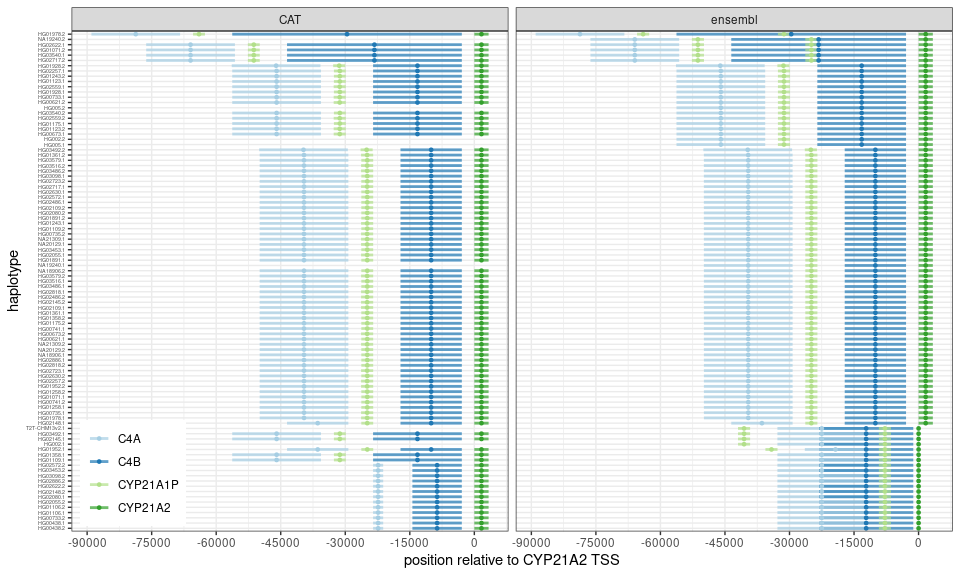
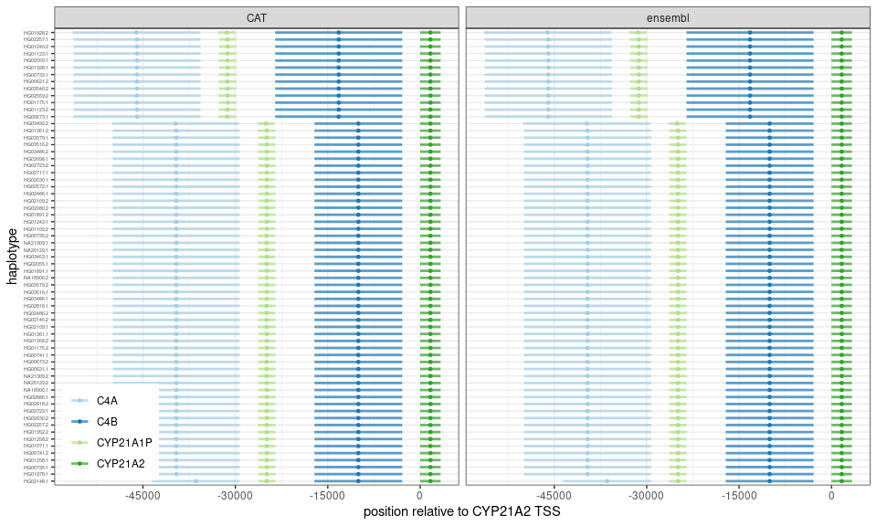
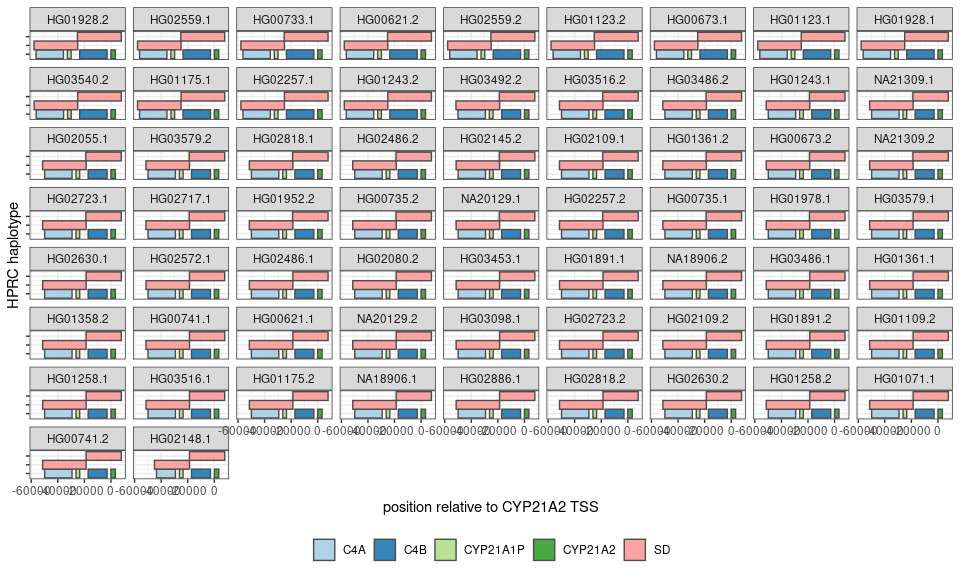

# Extract coordinates of the RCCX modules in the HPRC assemblies

``` r
suppressPackageStartupMessages(library(dplyr))
suppressPackageStartupMessages(library(ggplot2))
suppressPackageStartupMessages(library(GenomicRanges))
```

## Genes of interest

``` r
genes = c('CYP21A1P', 'CYP21A2', 'C4B', 'C4A')
```

## Read ensembl annot

``` r
cyp.f = list.files('ensembl_cyp')
cyp.f = grep('cur.20211005', cyp.f, value=TRUE, invert=TRUE)

importCyp <- function(cyp.f){
  df = read.table(paste0('ensembl_cyp/', cyp.f), as.is=TRUE, sep='\t')
  df = df[,c(1,3:5,7,9)]
  colnames(df) = c('seqnames', 'type', 'start', 'end', 'strand', 'info')
  df %>% filter(type %in% c('pseudogene', 'gene')) %>%
    mutate(gene=gsub('.*Name=([^;]+).*', '\\1', info),
           sample=gsub('.cyp21a.gff3', '', cyp.f),
           seqnames=as.character(seqnames)) %>%
    select(sample, gene, everything())
}

df.e = lapply(cyp.f, importCyp) %>% bind_rows
df.e = df.e %>% filter(gene %in% genes) %>%
  mutate(hap=ifelse(grepl('mat', sample), 2, 1),
         sample=gsub('\\..*', '', sample),
         sample=paste0(sample, '.', hap)) %>%
  select(-hap)
```

## Read CAT annotation

``` r
cyp.f = list.files('cat_cyp', 'cyp21a.gff3')

importCyp <- function(cyp.f){
  df = read.table(paste0('cat_cyp/', cyp.f), as.is=TRUE)
  df = df[,c(1,3:5,7,9)]
  colnames(df) = c('seqnames', 'type', 'start', 'end', 'strand', 'info')
  df %>% filter(type=='gene') %>%
    mutate(gene=gsub('source_gene_common_name=([^;]+).*', '\\1', info),
           sample=gsub('.cyp21a.gff3', '', cyp.f)) %>%
    select(sample, gene, everything())
}

df.c = lapply(cyp.f, importCyp) %>% bind_rows
df.c = df.c %>% filter(gene %in% genes)
```

## Merge annotations and flip haplotypes

Some assembled contigs are assembled “in reverse”. Flip them based on
the orientation of the *CYP21A2* gene. That way we’ll be comparing the
same strand across all assemblies.

``` r
df = rbind(
  df.e %>% mutate(source='ensembl'),
  df.c %>% mutate(source='CAT')
)

## flip if CYP21A2 is on - strand of the contig
flipStrand <- function(df){
  cyp2.strand = df$strand[which(df$gene=='CYP21A2')]
  if(cyp2.strand[1] == '-'){
    p.min = min(df$start)
    p.max = max(df$end)
    df = df %>% mutate(start.n=p.max-end+p.min,
                       end=p.max-start+p.min,
                       start=start.n,
                       strand=ifelse(strand=='+', '-', '+')) %>%
      select(-start.n)
  }
  return(df)
}

df.f = df %>% group_by(source, sample) %>% do(flipStrand(.))
```

## Plot the gene annotation for all assemblies

``` r
ggp.df = df.f %>% filter(gene %in% genes) %>%
  group_by(source, sample) %>%
  mutate(end=end-start[gene=='CYP21A2'],
         start=start-start[gene=='CYP21A2'],
         spread=diff(range(start))) %>%
  ungroup %>% arrange(spread, sample) %>%
  mutate(sample=factor(sample, unique(sample)))
ggplot(ggp.df, aes(x=start, xend=end, y=sample, yend=sample, color=gene)) +
  geom_segment(linewidth=1, alpha=.7) +
  geom_point(aes(x=(start+end)/2), size=1) + 
  theme_bw() +
  scale_color_brewer(palette='Paired') + 
  scale_x_continuous(breaks=seq(-15e5, 15e5, 15000)) +
  xlab('position relative to CYP21A2 TSS') +
  ylab('haplotype') +
  theme(legend.position=c(.01,.01), legend.justification=c(0,0),
        legend.title=element_blank(),
        axis.text.y=element_text(size=4)) +
  facet_grid(.~source)
```

<!-- -->

Some annotations look a bit suspicious (top and bottom ones). They are
not consistent between CAT and Ensembl and some have very small genes
annotated.

## Extract all haplotypes that have exactly one CYP21A1P and one CYP21A2

Some haplotypes might have deletions/fusions or three-modules alleles
which confused the annotation (see above). To be safe, we could focus on
haplotypes with exactly one *CYP21A2* and *CYP21A1P*.

``` r
hap.sel = df.f %>%
  mutate(size=end-start) %>%
  group_by(sample, source) %>%
  filter(sum(gene=='CYP21A1P')==1, sum(gene=='CYP21A2')==1, size[gene=='CYP21A2']> 300) %>%
  group_by(sample) %>% filter(length(unique(source))>1) %>% 
  .$sample %>% unique

ggp.df = df.f %>% filter(sample %in% hap.sel,
                         gene %in% genes) %>%
  group_by(source, sample) %>%
  mutate(end=end-start[gene=='CYP21A2'],
         start=start-start[gene=='CYP21A2'],
         spread=diff(range(start))) %>%
  ungroup %>% arrange(spread, sample) %>%
  mutate(sample=factor(sample, unique(sample)))
ggplot(ggp.df, aes(x=start, xend=end, y=sample, yend=sample, color=gene)) +
  geom_segment(linewidth=1, alpha=.7) +
  geom_point(aes(x=(start+end)/2), size=1) + 
  theme_bw() +
  scale_color_brewer(palette='Paired') + 
  scale_x_continuous(breaks=seq(-15e5, 15e5, 15000)) +
  xlab('position relative to CYP21A2 TSS') +
  ylab('haplotype') +
  theme(legend.position=c(.01,.01), legend.justification=c(0,0),
        legend.title=element_blank(),
        axis.text.y=element_text(size=4)) +
  facet_grid(.~source)
```

<!-- -->

The annotation of those assemblies look clean and consistent.

## Use segmental duplications to define modules

``` r
sd.f = list.files('raw_annotation/', 'sedef.bedpe')

importSd <- function(sd.f, df){
  sd = read.table(paste0('raw_annotation/', sd.f), as.is=TRUE, sep='\t', comment.char='')
  sd = c(
    GRanges(gsub(".*#", "", sd[,1]), IRanges(sd[,2], sd[,3])),
    GRanges(gsub(".*#", "", sd[,4]), IRanges(sd[,5], sd[,6]))
  )
  samp = gsub('.sedef.bedpe', '', sd.f)
  gr = df %>% filter(sample==samp) %>% makeGRangesFromDataFrame
  sd.df = suppressWarnings(subsetByOverlaps(sd, gr)) %>% as.data.frame %>%
    mutate(sample=samp, type='SD')
}

sd.df = lapply(sd.f, importSd, df=df.c) %>% bind_rows

## filter SD within SDs
sd.gr = makeGRangesFromDataFrame(sd.df)
ol = findOverlaps(sd.gr, sd.gr, type='within') %>%
  as.data.frame %>%
  mutate(sample.q=sd.df$sample[queryHits],
         sample.s=sd.df$sample[subjectHits]) %>%
  filter(sample.q == sample.s, queryHits != subjectHits)
## which segmental duplication to keep
sd.idx = setdiff(1:nrow(sd.df), ol$queryHits)

ggp.df = rbind(
  df.c %>% filter(gene %in% genes) %>%
  mutate(type='gene') %>%
  select(sample, start, end, gene, type, strand),
  sd.df[sd.idx,] %>% group_by(sample) %>%
  mutate(gene='SD') %>%
  select(sample, start, end, gene, type, strand)) %>%
  group_by(sample) %>% do(flipStrand(.))  

## to position the ranges in a compact way without overlap
## basically places a range in the same levels if there is space
## otherwise increment the y position
repositionRange <- function(df){
  yend = c(-Inf)
  ypos = rep(NA, nrow(df))
  for(ii in 1:nrow(df)){
    if(all(yend >= df$start[ii])){
      yend = c(yend, -Inf)
    }
    ypos[ii] = min(which(yend < df$start[ii]))
    yend[ypos[ii]] = df$end[ii]
  }
  df$ypos = ypos
  df
}

ggp.df %>%
  filter(sample %in% hap.sel) %>% 
  group_by(sample) %>% mutate(end=end-start[gene=='CYP21A2'],
                              start=start-start[gene=='CYP21A2'],
                              spread=diff(range(start))) %>%
  arrange(desc(type), start) %>% 
  do(repositionRange(.)) %>% 
  ungroup %>% arrange(spread, sample) %>%
  mutate(sample=factor(sample, rev(unique(sample)))) %>%
  ggplot(aes(xmin=start, xmax=end, ymin=ypos-.5, ymax=ypos+.5, fill=gene)) +
  geom_rect(alpha=.9, colour='grey30') +
  theme_bw() +
  scale_fill_brewer(palette='Paired') + 
  ## scale_x_continuous(breaks=seq(-1e5, 1e5, 10000)) +
  xlab('position relative to CYP21A2 TSS') +
  ylab('HPRC haplotype') +
  theme(legend.position='bottom',
        legend.title=element_blank(), strip.text.y=element_text(angle=0),
        axis.text.y=element_blank()) +
  facet_wrap(~sample)
```

<!-- -->

## Select SD for selected haplotypes

``` r
sd.gr = sd.df[sd.idx,] %>% select(-strand) %>% filter(sample %in% hap.sel) %>% 
  makeGRangesFromDataFrame(keep.extra.columns=TRUE)
## mark the ones overlapping CYP21A2
gene.gr = df.c %>% filter(sample %in% hap.sel, gene=='CYP21A2') %>%
  makeGRangesFromDataFrame(keep.extra.columns=TRUE)
sd.gr$ol.gene = overlapsAny(sd.gr, gene.gr)
## double check that all haplotypes have 2 SDs and only one marked
sd.gr %>% as.data.frame %>% group_by(sample) %>%
  summarize(ntot=n(), ngene=sum(ol.gene)) %>%
  group_by(ntot, ngene) %>% summarize(n=n())
```

    ## `summarise()` has grouped output by 'ntot'. You can override using the
    ## `.groups` argument.

    ## # A tibble: 1 × 3
    ## # Groups:   ntot [1]
    ##    ntot ngene     n
    ##   <int> <int> <int>
    ## 1     2     1    65

## Write coordinates for each module

``` r
sd.gr %>% as.data.frame %>% select(-strand, -width, -type) %>% 
  mutate(label=ifelse(ol.gene, 'c2', 'c1'),
         label=paste0(label, '_', sample),
         coord=paste0(gsub('\\.', '#', sample), '#', seqnames, ':', start, '-', end)) %>%
  select(sample, coord, label) %>%
  write.table(file='hprc.cyp21a.coords.tsv', sep='\t',
              row.names=FALSE, col.names=FALSE, quote=FALSE)
```
