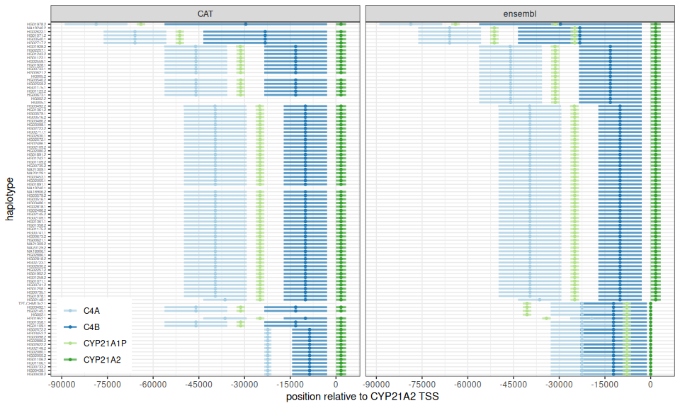

# Extract coordinates of the RCCX modules in the HPRC assemblies

``` r
suppressPackageStartupMessages(library(dplyr))
suppressPackageStartupMessages(library(ggplot2))
suppressPackageStartupMessages(library(GenomicRanges))
```

## Genes of interest

``` r
genes = c('CYP21A1P', 'CYP21A2', 'C4B', 'C4A')
```

## Read ensembl annot

``` r
cyp.f = list.files('ensembl_cyp')
cyp.f = grep('cur.20211005', cyp.f, value=TRUE, invert=TRUE)

importCyp <- function(cyp.f){
  df = read.table(paste0('ensembl_cyp/', cyp.f), as.is=TRUE, sep='\t')
  df = df[,c(1,3:5,7,9)]
  colnames(df) = c('seqnames', 'type', 'start', 'end', 'strand', 'info')
  df %>% filter(type %in% c('pseudogene', 'gene')) %>%
    mutate(gene=gsub('.*Name=([^;]+).*', '\\1', info),
           sample=gsub('.cyp21a.gff3', '', cyp.f),
           seqnames=as.character(seqnames)) %>%
    select(sample, gene, everything())
}

df.e = lapply(cyp.f, importCyp) %>% bind_rows
df.e = df.e %>% filter(gene %in% genes) %>%
  mutate(hap=ifelse(grepl('mat', sample), 2, 1),
         sample=gsub('\\..*', '', sample),
         sample=paste0(sample, '.', hap)) %>%
  select(-hap)
```

## Read CAT annotation

``` r
cyp.f = list.files('cat_cyp', 'cyp21a.gff3')

importCyp <- function(cyp.f){
  df = read.table(paste0('cat_cyp/', cyp.f), as.is=TRUE)
  df = df[,c(1,3:5,7,9)]
  colnames(df) = c('seqnames', 'type', 'start', 'end', 'strand', 'info')
  df %>% filter(type=='gene') %>%
    mutate(gene=gsub('source_gene_common_name=([^;]+).*', '\\1', info),
           sample=gsub('.cyp21a.gff3', '', cyp.f)) %>%
    select(sample, gene, everything())
}

df.c = lapply(cyp.f, importCyp) %>% bind_rows
df.c = df.c %>% filter(gene %in% genes)
```

## Merge annotations and flip haplotypes

Some assembled contigs are assembled “in reverse”. Flip them based on
the orientation of the *CYP21A2* gene. That way we’ll be comparing the
same strand across all assemblies.

``` r
df = rbind(
  df.e %>% mutate(source='ensembl'),
  df.c %>% mutate(source='CAT')
)

## flip if CYP21A2 is on - strand of the contig
flipStrand <- function(df){
  cyp2.strand = df$strand[which(df$gene=='CYP21A2')]
  if(cyp2.strand[1] == '-'){
    p.min = min(df$start)
    p.max = max(df$end)
    df = df %>% mutate(start.n=p.max-end+p.min,
                       end=p.max-start+p.min,
                       start=start.n,
                       strand=ifelse(strand=='+', '-', '+')) %>%
      select(-start.n)
  }
  return(df)
}

df.f = df %>% group_by(source, sample) %>% do(flipStrand(.))
```

## Plot the gene annotation for all assemblies

``` r
ggp.df = df.f %>% filter(gene %in% genes) %>%
  group_by(source, sample) %>%
  mutate(end=end-start[gene=='CYP21A2'],
         start=start-start[gene=='CYP21A2'],
         spread=diff(range(start))) %>%
  ungroup %>% arrange(spread, sample) %>%
  mutate(sample=factor(sample, unique(sample)))
ggplot(ggp.df, aes(x=start, xend=end, y=sample, yend=sample, color=gene)) +
  geom_segment(linewidth=1, alpha=.7) +
  geom_point(aes(x=(start+end)/2), size=1) + 
  theme_bw() +
  scale_color_brewer(palette='Paired') + 
  scale_x_continuous(breaks=seq(-15e5, 15e5, 15000)) +
  xlab('position relative to CYP21A2 TSS') +
  ylab('haplotype') +
  theme(legend.position=c(.01,.01), legend.justification=c(0,0),
        legend.title=element_blank(),
        axis.text.y=element_text(size=4)) +
  facet_grid(.~source)
```

<!-- -->

## Compute the coordinates of regions of interest

We want to define regions that contain the genes of interest and add
flanking regions.

``` r
flank.size = 60000

reg.df = df.f %>% group_by(sample, seqnames) %>%
  summarize(start=min(start)-flank.size, end=max(end)+flank.size) %>%
  ungroup %>%
    mutate(coord=paste0(gsub('\\.', '#', sample), '#', seqnames, ':', start, '-', end)) %>% 
    select(sample, coord)
```

    ## `summarise()` has grouped output by 'sample'. You can override using the
    ## `.groups` argument.

``` r
head(reg.df)
```

    ## # A tibble: 6 × 2
    ##   sample    coord                                        
    ##   <chr>     <chr>                                        
    ## 1 HG002.1   HG002#1#JAHKSE010000066.1:5225442-5387423    
    ## 2 HG002.2   HG002#2#JAHKSD010000045.1:27049085-27228672  
    ## 3 HG00438.1 HG00438#1#JAHBCB010000040.1:24217374-24370200
    ## 4 HG00438.2 HG00438#2#JAHBCA010000042.1:24346257-24499080
    ## 5 HG005.1   HG005#1#JAHEPO010000054.1:5078009-5257595    
    ## 6 HG005.2   HG005#2#JAHEPN010000064.1:6797890-6977475

## Write coordinates for region

``` r
write.table(reg.df, file='hprc.cyp21a.haps.coords.tsv', sep='\t', row.names=FALSE, col.names=FALSE, quote=FALSE)
```
