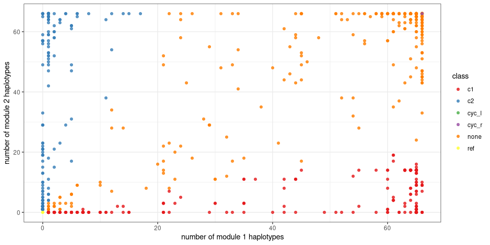
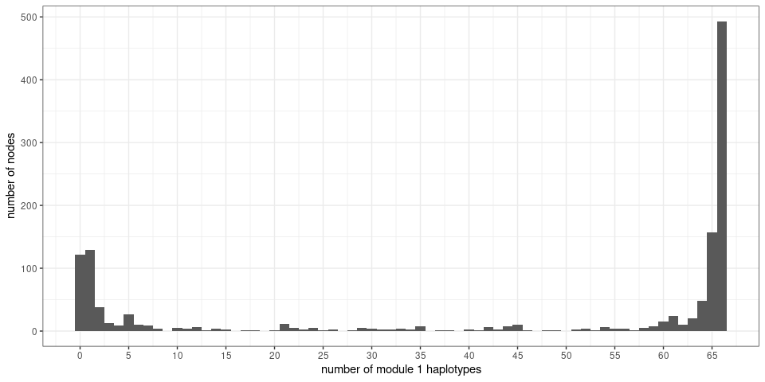
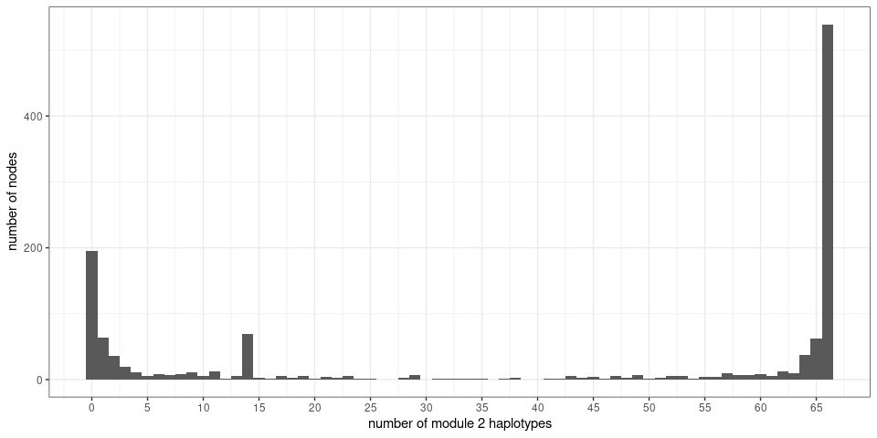
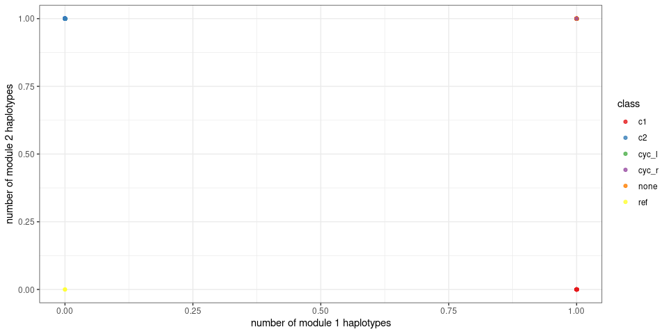
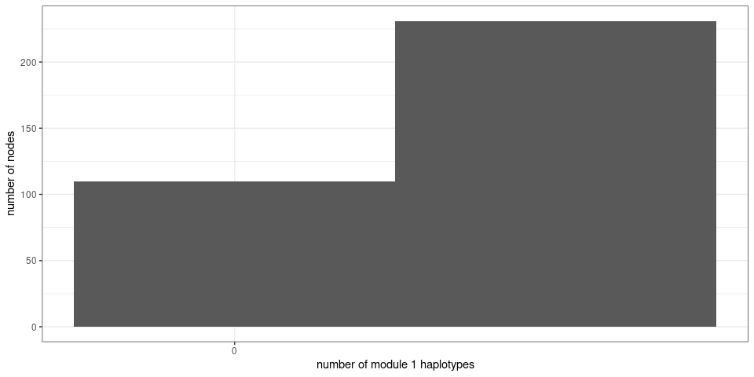
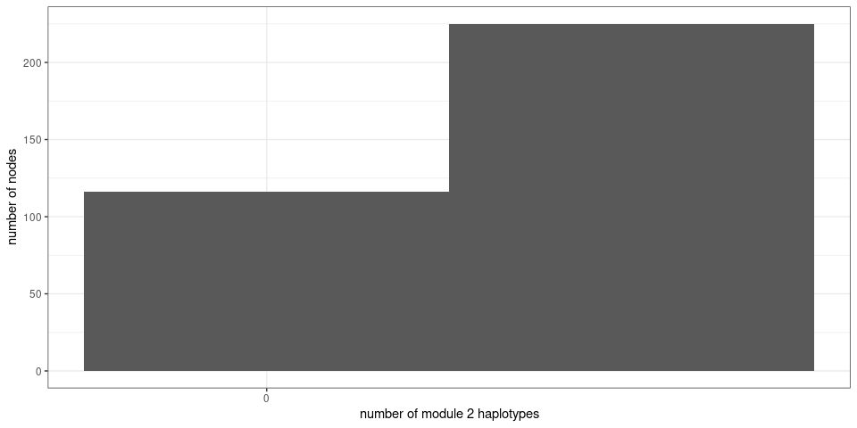

RCCX Minigraph-Cactus pangenome summary
================

``` r
library(dplyr)
library(ggplot2)
library(knitr)
```

# GRCh38 + HPRC alleles

## Node metadata

``` r
ninfo = read.table('rccx.grch38_hprc.mc.node_info.tsv', as.is=TRUE, header=TRUE)
```

``` r
ninfo %>% group_by(class) %>%
  summarize(n=n(), mean.size.bp=round(mean(size), 1),
            total.bp=round(sum(size), 1)) %>%
  kable(format.args=list(big.mark=','))
```

| class  |   n | mean.size.bp | total.bp |
| :----- | --: | -----------: | -------: |
| c1     | 335 |         19.9 |    6,657 |
| c2     | 220 |          2.5 |      547 |
| cyc\_l |   1 |         87.0 |       87 |
| cyc\_r |   1 |         13.0 |       13 |
| none   | 719 |         36.5 |   26,209 |
| ref    |   2 |    299,989.5 |  599,979 |

Node classes:

  - *c1*: specific to module 1
  - *c2*: specific to module 1
  - *cyc\_l*/*cyc\_r*: nodes involved in the loop back, e.g. from end of
    module 1 to beginning of module 2.
  - *none*: uninformative nodes
  - *ref*: flanking reference nodes, outside of the RCCX modules.

<!-- end list -->

``` r
ggplot(ninfo, aes(x=c1, y=c2, color=class)) +
  geom_point(alpha=.8) +
  scale_color_brewer(palette='Set1') +
  xlab('number of module 1 haplotypes') +
  ylab('number of module 2 haplotypes') +
  theme_bw()
```

<!-- -->

``` r
ggplot(ninfo, aes(x=c1)) +
  geom_histogram(binwidth=1) +
  xlab('number of module 1 haplotypes') +
  ylab('number of nodes') + 
  scale_x_continuous(breaks=seq(0,100,5)) + 
  theme_bw()
```

<!-- -->

``` r
ggplot(ninfo, aes(x=c2)) +
  geom_histogram(binwidth=1) +
  xlab('number of module 2 haplotypes') +
  ylab('number of nodes') +
  scale_x_continuous(breaks=seq(0,100,5)) + 
  theme_bw()
```

<!-- -->

# GRCh38

## Node metadata

``` r
ninfo = read.table('rccx.grch38.mc.node_info.tsv', as.is=TRUE, header=TRUE)
```

``` r
ninfo %>% group_by(class) %>%
  summarize(n=n(), mean.size.bp=round(mean(size), 1),
            total.bp=round(sum(size), 1)) %>%
  kable(format.args=list(big.mark=','))
```

| class  |   n | mean.size.bp | total.bp |
| :----- | --: | -----------: | -------: |
| c1     | 114 |          1.1 |      128 |
| c2     | 108 |          2.2 |      241 |
| cyc\_l |   1 |        135.0 |      135 |
| cyc\_r |   1 |         13.0 |       13 |
| none   | 115 |        282.3 |   32,465 |
| ref    |   2 |    300,000.0 |  600,000 |

Node classes:

  - *c1*: specific to module 1
  - *c2*: specific to module 1
  - *cyc\_l*/*cyc\_r*: nodes involved in the loop back, e.g. from end of
    module 1 to beginning of module 2.
  - *none*: uninformative nodes
  - *ref*: flanking reference nodes, outside of the RCCX modules.

<!-- end list -->

``` r
ggplot(ninfo, aes(x=c1, y=c2, color=class)) +
  geom_point(alpha=.8) +
  scale_color_brewer(palette='Set1') +
  xlab('number of module 1 haplotypes') +
  ylab('number of module 2 haplotypes') +
  theme_bw()
```

<!-- -->

``` r
ggplot(ninfo, aes(x=c1)) +
  geom_histogram(binwidth=1) +
  xlab('number of module 1 haplotypes') +
  ylab('number of nodes') + 
  scale_x_continuous(breaks=seq(0,100,5)) + 
  theme_bw()
```

<!-- -->

``` r
ggplot(ninfo, aes(x=c2)) +
  geom_histogram(binwidth=1) +
  xlab('number of module 2 haplotypes') +
  ylab('number of nodes') +
  scale_x_continuous(breaks=seq(0,100,5)) + 
  theme_bw()
```

<!-- -->
