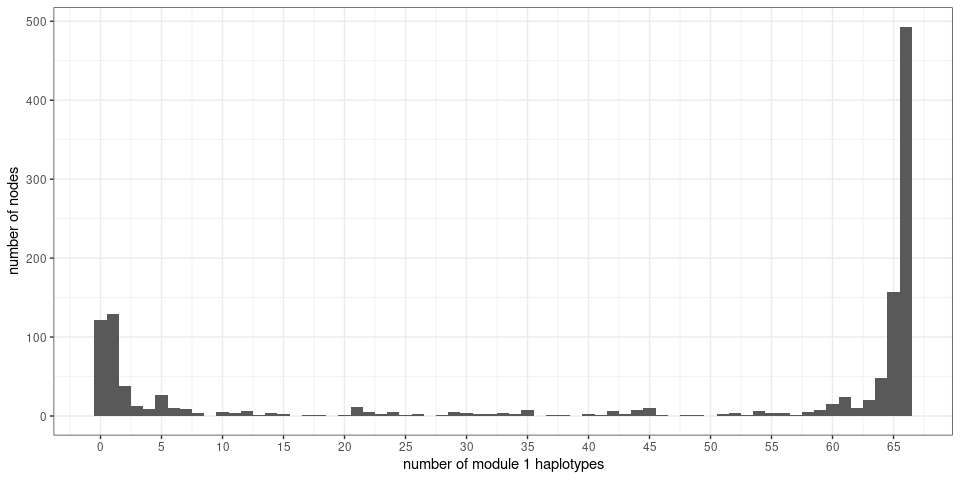
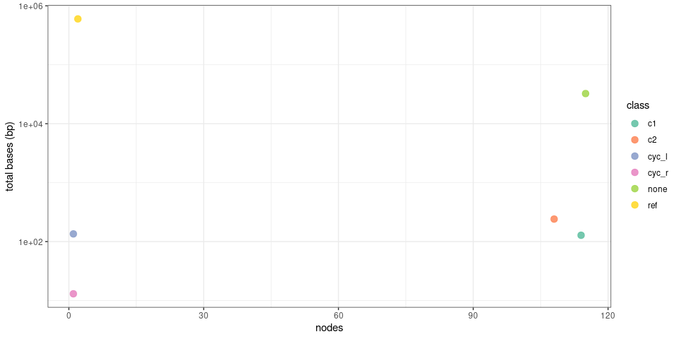
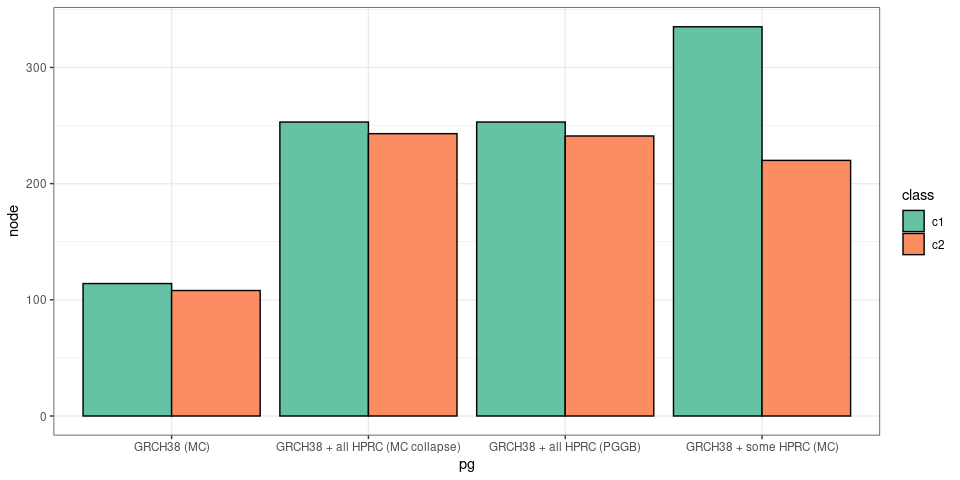

RCCX pangenome summary
================

  - [PGGB - GRCh38 + all HPRC alleles](#pggb---grch38--all-hprc-alleles)
  - [Minigraph-Cactus “collapse” - GRCh38 + all HPRC
    alleles](#minigraph-cactus-collapse---grch38--all-hprc-alleles)
  - [Minigraph-Cactus - GRCh38 + some HPRC
    alleles](#minigraph-cactus---grch38--some-hprc-alleles)
  - [Minigraph-Cactus - GRCh38 only](#minigraph-cactus---grch38-only)
  - [Comparing the different
    pangenomes](#comparing-the-different-pangenomes)
      - [Informative nodes](#informative-nodes)
      - [Informative nodes in the second half of the
        module](#informative-nodes-in-the-second-half-of-the-module)
      - [Informative nodes within the gene
        region](#informative-nodes-within-the-gene-region)

``` r
library(dplyr)
library(ggplot2)
library(knitr)
```

The nodes in the pangenome are annotated into a few *classes*, used
during the analysis. The most informative nodes are the ones that seem
specific to either module 1 or 2. In the analysis below, the node
classes are labeled as:

  - *c1*: specific to module 1
  - *c2*: specific to module 1
  - *cyc\_l*/*cyc\_r*: nodes involved in the loop back, e.g. from end of
    module 1 to beginning of module 2.
  - *none*: uninformative nodes
  - *ref*: flanking reference nodes, outside of the RCCX modules.

Multiple pangenomes were tested, integrating different amount of
alleles, and using different methods (Minigraph-Cactus and PGGB). Below
are some summary statistics about the resulting pangenomes.

# PGGB - GRCh38 + all HPRC alleles

Pangenome built with PGGB using GRCh38 and all of the HPRC v1 phased
assemblies. No external gene annotation was involved to identify the
modules. They were predicted based on the pangenome traversal and how
similar they were from modules 1/2 in GRCh38.

``` r
ninfo = read.table('rccx.grch38_hprc.pggb.node_info.tsv', as.is=TRUE, header=TRUE)
```

``` r
ninfo %>% group_by(class) %>%
  summarize(node=n(), mean.size.bp=round(mean(size), 1),
            total.bp=sum(size)) %>%
  kable(format.args=list(big.mark=','))
```

| class  |  node | mean.size.bp | total.bp |
| :----- | ----: | -----------: | -------: |
| c1     |   253 |          1.0 |      263 |
| c2     |   241 |          1.6 |      394 |
| cyc\_l |     1 |         91.0 |       91 |
| cyc\_r |     1 |          9.0 |        9 |
| none   | 1,641 |         20.6 |   33,755 |
| ref    | 1,679 |        357.1 |  599,647 |

``` r
ninfo %>% group_by(class) %>%
  summarize(n=n(), total.bp=sum(size)) %>%
  ggplot(aes(x=n, y=total.bp, color=class)) +
  geom_point(size=3, alpha=.9) + theme_bw() +
  scale_color_brewer(palette='Set2') + 
  scale_y_log10() +
  xlab('nodes') + ylab('total bases (bp)')
```

<!-- -->

``` r
ggplot(ninfo, aes(x=c1, y=c2, color=class)) +
  geom_point(alpha=.8) +
  scale_color_brewer(palette='Set1') +
  xlab('number of module 1 haplotypes') +
  ylab('number of module 2 haplotypes') +
  theme_bw()
```

<!-- -->

``` r
ggplot(ninfo, aes(x=c1)) +
  geom_histogram(binwidth=1) +
  xlab('number of module 1 haplotypes') +
  ylab('number of nodes') + 
  scale_x_continuous(breaks=seq(0,100,5)) + 
  theme_bw()
```

<!-- -->

``` r
ggplot(ninfo, aes(x=c2)) +
  geom_histogram(binwidth=1) +
  xlab('number of module 2 haplotypes') +
  ylab('number of nodes') +
  scale_x_continuous(breaks=seq(0,100,5)) + 
  theme_bw()
```

<!-- -->

# Minigraph-Cactus “collapse” - GRCh38 + all HPRC alleles

Pangenome built with an experimental “collapse” feature of
Minigraph-Cactus which allow for some collapsing based on
self-alignment. As for the PGGB pangenome above, GRCh38 and all of the
HPRC v1 phased assemblies were used. No external gene annotation was
involved to identify the modules. They were predicted based on the
pangenome traversal and how similar they were from modules 1/2 in
GRCh38.

``` r
ninfo = read.table('rccx.grch38_hprc.mcc.node_info.tsv', as.is=TRUE, header=TRUE)
```

``` r
ninfo %>% group_by(class) %>%
  summarize(node=n(), mean.size.bp=round(mean(size), 1),
            total.bp=sum(size)) %>%
  kable(format.args=list(big.mark=','))
```

| class  |  node | mean.size.bp | total.bp |
| :----- | ----: | -----------: | -------: |
| c1     |   253 |          1.0 |      264 |
| c2     |   243 |          1.6 |      378 |
| cyc\_l |     1 |         90.0 |       90 |
| cyc\_r |     1 |         44.0 |       44 |
| none   | 1,622 |         20.7 |   33,548 |
| ref    | 1,618 |        370.8 |  600,025 |

``` r
ninfo %>% group_by(class) %>%
  summarize(n=n(), total.bp=sum(size)) %>%
  ggplot(aes(x=n, y=total.bp, color=class)) +
  geom_point(size=3, alpha=.9) + theme_bw() +
  scale_color_brewer(palette='Set2') + 
  scale_y_log10() +
  xlab('nodes') + ylab('total bases (bp)')
```

<!-- -->

``` r
ggplot(ninfo, aes(x=c1, y=c2, color=class)) +
  geom_point(alpha=.8) +
  scale_color_brewer(palette='Set1') +
  xlab('number of module 1 haplotypes') +
  ylab('number of module 2 haplotypes') +
  theme_bw()
```

<!-- -->

``` r
ggplot(ninfo, aes(x=c1)) +
  geom_histogram(binwidth=1) +
  xlab('number of module 1 haplotypes') +
  ylab('number of nodes') + 
  scale_x_continuous(breaks=seq(0,100,5)) + 
  theme_bw()
```

<!-- -->

``` r
ggplot(ninfo, aes(x=c2)) +
  geom_histogram(binwidth=1) +
  xlab('number of module 2 haplotypes') +
  ylab('number of nodes') +
  scale_x_continuous(breaks=seq(0,100,5)) + 
  theme_bw()
```

<!-- -->

# Minigraph-Cactus - GRCh38 + some HPRC alleles

Pangenome built with Minigraph-Cactus using GRCh38 and a subset of the
HPRC v1 phased assemblies. The HPRC haplotypes were selected if the gene
annotation was concordant between CAT and Ensembl, and were identified
two modules.

``` r
ninfo = read.table('rccx.grch38_hprc.mc.node_info.tsv', as.is=TRUE, header=TRUE)
```

``` r
ninfo %>% group_by(class) %>%
  summarize(node=n(), mean.size.bp=round(mean(size), 1),
            total.bp=sum(size)) %>%
  kable(format.args=list(big.mark=','))
```

| class  | node | mean.size.bp | total.bp |
| :----- | ---: | -----------: | -------: |
| c1     |  335 |         19.9 |    6,657 |
| c2     |  220 |          2.5 |      547 |
| cyc\_l |    1 |         87.0 |       87 |
| cyc\_r |    1 |         13.0 |       13 |
| none   |  719 |         36.5 |   26,209 |
| ref    |    2 |    299,989.5 |  599,979 |

``` r
ninfo %>% group_by(class) %>%
  summarize(n=n(), total.bp=sum(size)) %>%
  ggplot(aes(x=n, y=total.bp, color=class)) +
  geom_point(size=3, alpha=.9) + theme_bw() +
  scale_color_brewer(palette='Set2') + 
  scale_y_log10() +
  xlab('nodes') + ylab('total bases (bp)')
```

<!-- -->

``` r
ggplot(ninfo, aes(x=c1, y=c2, color=class)) +
  geom_point(alpha=.8) +
  scale_color_brewer(palette='Set1') +
  xlab('number of module 1 haplotypes') +
  ylab('number of module 2 haplotypes') +
  theme_bw()
```

<!-- -->

``` r
ggplot(ninfo, aes(x=c1)) +
  geom_histogram(binwidth=1) +
  xlab('number of module 1 haplotypes') +
  ylab('number of nodes') + 
  scale_x_continuous(breaks=seq(0,100,5)) + 
  theme_bw()
```

<!-- -->

``` r
ggplot(ninfo, aes(x=c2)) +
  geom_histogram(binwidth=1) +
  xlab('number of module 2 haplotypes') +
  ylab('number of nodes') +
  scale_x_continuous(breaks=seq(0,100,5)) + 
  theme_bw()
```

<!-- -->

# Minigraph-Cactus - GRCh38 only

Pangenome built with Minigraph-Cactus using only GRCh38. The two
reference modules are collapsed.

``` r
ninfo = read.table('rccx.grch38.mc.node_info.tsv', as.is=TRUE, header=TRUE)
```

``` r
ninfo %>% group_by(class) %>%
  summarize(node=n(), mean.size.bp=round(mean(size), 1),
            total.bp=sum(size)) %>%
  kable(format.args=list(big.mark=','))
```

| class  | node | mean.size.bp | total.bp |
| :----- | ---: | -----------: | -------: |
| c1     |  114 |          1.1 |      128 |
| c2     |  108 |          2.2 |      241 |
| cyc\_l |    1 |        135.0 |      135 |
| cyc\_r |    1 |         13.0 |       13 |
| none   |  115 |        282.3 |   32,465 |
| ref    |    2 |    300,000.0 |  600,000 |

``` r
ninfo %>% group_by(class) %>%
  summarize(n=n(), total.bp=sum(size)) %>%
  ggplot(aes(x=n, y=total.bp, color=class)) +
  geom_point(size=3, alpha=.9) + theme_bw() +
  scale_color_brewer(palette='Set2') + 
  scale_y_log10() +
  xlab('nodes') + ylab('total bases (bp)')
```

<!-- -->

# Comparing the different pangenomes

``` r
ninfo = rbind(
  read.table('rccx.grch38_hprc.mc.node_info.tsv', as.is=TRUE, header=TRUE) %>%
  mutate(pg='GRCH38 + some HPRC (MC)'),
  read.table('rccx.grch38_hprc.mcc.node_info.tsv', as.is=TRUE, header=TRUE) %>%
  mutate(pg='GRCH38 + all HPRC (MC collapse)'),
  read.table('rccx.grch38.mc.node_info.tsv', as.is=TRUE, header=TRUE) %>%
  mutate(pg='GRCH38 (MC)'),
  read.table('rccx.grch38_hprc.pggb.node_info.tsv', as.is=TRUE, header=TRUE) %>%
  mutate(pg='GRCH38 + all HPRC (PGGB)')
)

ninfo %>% group_by(pg, class) %>%
  summarize(n=n(), total.bp=sum(size)) %>%
  ggplot(aes(x=n, y=total.bp, color=class, shape=pg)) +
  geom_point(size=3, alpha=.9) + theme_bw() +
  scale_color_brewer(palette='Set2') + 
  scale_y_log10() +
  xlab('nodes') + ylab('total bases (bp)')
```

<!-- -->

## Informative nodes

The most relevant metric is the number of informative nodes in the
pangenome, i.e. those that seem to be specific to module 1 (`c1`) or
module (`c2`).

``` r
ninfo %>% group_by(pg, class) %>%
  summarize(node=n(), total.bp=sum(size)) %>%
  filter(class %in% c('c1','c2')) %>% 
  ggplot(aes(x=pg, y=node, fill=class)) +
  geom_col(position='dodge', color='black') +
  theme_bw() +
  scale_fill_brewer(palette='Set2')
```

<!-- -->

## Informative nodes in the second half of the module

There is a transposon polymorphism toward the beginning of the module.
It tends to be present in module 1 alleles and was assigned as *c1* in
the MC-GRCh38+HPRC pangenome. We can see that in the node summary for
that pangenome (mean size of *c1* nodes is large and total is about 6
kbp larger than in other pangenomes). That might explain the difference
we see in the graph above for module 1.

What if we restrict to the second half of the module (where CYP genes
are)?

``` r
config = rjson::fromJSON(file='rccx.grch38_hprc.mc.config.json')
c1_s = as.numeric(gsub('.+:(.+)-.+', '\\1', config$c1))
c1_e = as.numeric(gsub('.+:.+-(.+)', '\\1', config$c1))
min.pos = config$flank_size + (c1_e - c1_s) / 2

ninfo %>%
  filter(rpos_min > min.pos) %>% 
  group_by(pg, class) %>%
  summarize(node=n(), total.bp=sum(size)) %>%
  filter(class %in% c('c1','c2')) %>% 
  ggplot(aes(x=pg, y=node, fill=class)) +
  geom_col(position='dodge', color='black') +
  theme_bw() +
  scale_fill_brewer(palette='Set2')
```

<!-- -->

## Informative nodes within the gene region

What about in the actual region covered by *CYP21A2*?

``` r
# how much to offset position in the genome to match this local region
gen.offset = c1_s - config$flank_size

# get the CYP21A2 gene region
genes = read.table('CYP21A2.gencodev43.nearby_genes.tsv', as.is=TRUE, header=TRUE)
cyp.reg = genes %>% filter(gene_name=='CYP21A2') %>%
  summarize(start=min(start) - gen.offset,
            end=max(end) - gen.offset)

ninfo %>%
  filter(rpos_max > cyp.reg$start, rpos_max < cyp.reg$end) %>% 
  group_by(pg, class) %>%
  summarize(node=n(), total.bp=sum(size)) %>%
  filter(class %in% c('c1','c2')) %>% 
  ggplot(aes(x=pg, y=node, fill=class)) +
  geom_col(position='dodge', color='black') +
  theme_bw() +
  scale_fill_brewer(palette='Set2')
```

<!-- -->
